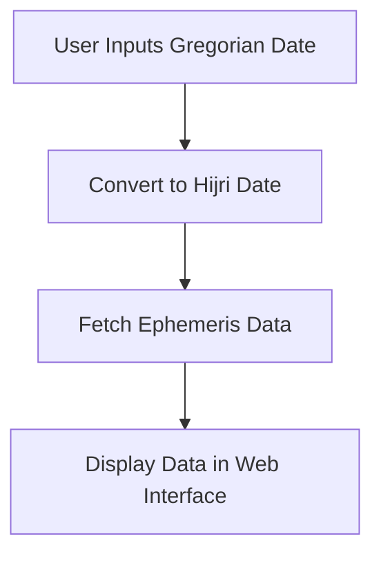

# Hijri-based Ephemeris Data

**Astronomical Data Visualization Aligned with the Hijri Calendar**

---

## 📘 Overview

This project presents a web-based application that visualizes astronomical ephemeris data in alignment with the Islamic Hijri calendar. Utilizing the Gradio framework, the application offers an interactive interface for users to explore celestial events and data corresponding to specific Hijri dates.

---

## 🌟 Features

- **Hijri Calendar Integration**: Converts Gregorian dates to Hijri dates, facilitating culturally relevant astronomical observations.
- **Ephemeris Data Retrieval**: Fetches precise astronomical data, including positions of celestial bodies, for specified dates.
- **Interactive Visualization**: Provides a user-friendly interface to input dates and view corresponding ephemeris data.
- **Web-Based Interface**: Accessible through a web browser without the need for local installations. ([Orbit Visualization and Ephemeris Generation 2](https://studylib.net/doc/7732789/orbit-visualization-and-ephemeris-generation-2?utm_source=chatgpt.com))

---

## 🛠️ Technologies Used

- **Python 3.10+**
- **Gradio**: For building the web-based user interface.
- **Hijri-Converter**: For converting Gregorian dates to Hijri dates.
- **Skyfield**: For astronomical computations and ephemeris data retrieval. ([Understanding The Lunar Calendar: A Comprehensive Guide To The Hijri ...](https://ethiopianholidayscalendar.pages.dev/new-pshslh-understanding-the-lunar-calendar-a-comprehensive-guide-to-the-hijri-calendar-zkrkpi-pics/?utm_source=chatgpt.com))

---

## 🚀 Getting Started

### Prerequisites

- Python 3.10 or higher installed on your system.

### Installation

1. **Clone the Repository**:
   ```bash
   git clone https://github.com/ainulyaqinmhd/Hijr-based_EphemerisData.git
   cd Hijr-based_EphemerisData
   ```

2. **Create and Activate a Virtual Environment** (optional but recommended):
   ```bash
   python -m venv venv
   source venv/bin/activate  # On Windows: venv\Scripts\activate
   ```

3. **Install Required Packages**:
   ```bash
   pip install -r requirements.txt
   ```

4. **Run the Application**:
   ```bash
   python app.py
   ```
   After running the above command, Gradio will launch the application and provide a local URL (e.g., `http://127.0.0.1:7860/`). Open this URL in your web browser to access the interface.

---

## 📁 Project Structure

- **`app.py`**: Main script that initializes and runs the Gradio application.
- **`requirements.txt`**: Specifies the Python dependencies required to run the application.
- **`README.md`**: Provides an overview and instructions for the project. ([Modeling Satellite Constellations Using Ephemeris Data - MATLAB ...](https://la.mathworks.com/help/satcom/ug/modeling-constellation-using-ephemeris-data.html?utm_source=chatgpt.com), [Definitions of ephemeris data. | Download Scientific Diagram](https://www.researchgate.net/figure/Definitions-of-ephemeris-data_tbl1_346554844?utm_source=chatgpt.com))

---

## 🔄 Workflow Diagram





---

## 📄 License

This project is licensed under the MIT License. See the [LICENSE](LICENSE) file for details.
